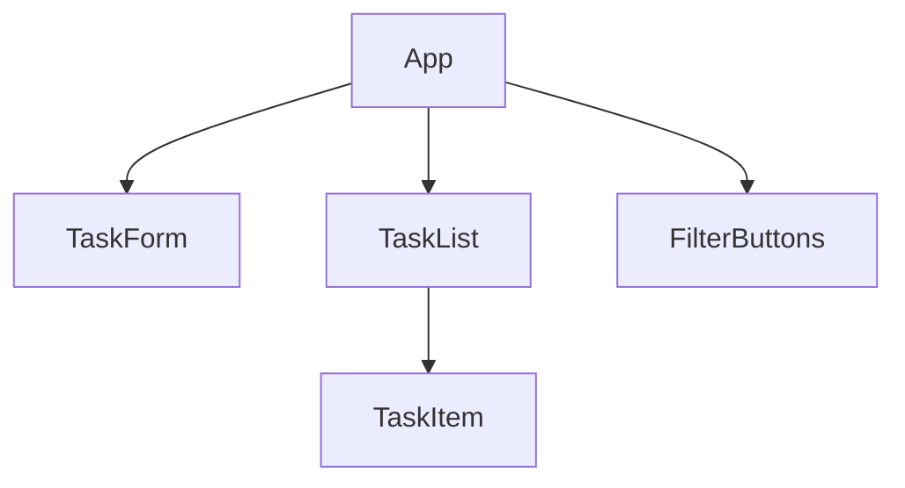
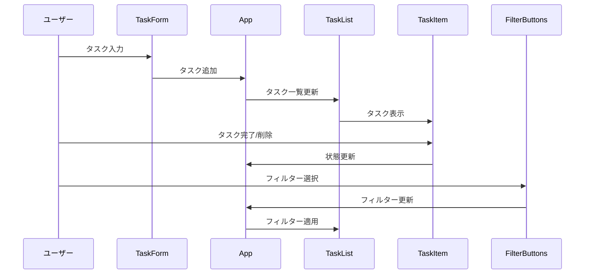

# Vue.js 演習課題: タスク管理アプリケーション

## 1. プロジェクト概要

このプロジェクトは、Vue.jsを使用して簡単なタスク管理アプリケーションを作成することを目的としています。このアプリケーションを通じて、Vue.jsの基本的な概念と機能を実践的に学ぶことができます。

## 2. 機能要件

1. タスクの追加
2. タスクの表示（一覧）
3. タスクの完了/未完了の切り替え
4. タスクの削除
5. タスクのフィルタリング（全て / 未完了 / 完了）

## 3. コンポーネント構造

以下は、アプリケーションのコンポーネント構造を示しています：

## 4. データフロー

タスクデータの流れは以下の通りです：

## 5. UIモックアップ

以下は、アプリケーションのシンプルなUIモックアップです：

<svg xmlns="http://www.w3.org/2000/svg" viewBox="0 0 400 300">
  <rect x="10" y="10" width="380" height="280" fill="#f0f0f0" stroke="#000000" stroke-width="2"/>
  <rect x="20" y="20" width="360" height="40" fill="#ffffff" stroke="#000000" stroke-width="2"/>
  <text x="30" y="45" font-family="Arial" font-size="16">新しいタスク</text>
  <rect x="300" y="25" width="70" height="30" fill="#4CAF50" stroke="#000000" stroke-width="2"/>
  <text x="315" y="45" font-family="Arial" font-size="16" fill="#ffffff">追加</text>
  
  <rect x="20" y="70" width="360" height="30" fill="#ffffff" stroke="#000000" stroke-width="2"/>
  <text x="30" y="90" font-family="Arial" font-size="16">タスク1</text>
  <rect x="320" y="75" width="50" height="20" fill="#f44336" stroke="#000000" stroke-width="2"/>
  <text x="330" y="90" font-family="Arial" font-size="14" fill="#ffffff">削除</text>
  
  <rect x="20" y="110" width="360" height="30" fill="#ffffff" stroke="#000000" stroke-width="2"/>
  <text x="30" y="130" font-family="Arial" font-size="16" text-decoration="line-through">タスク2</text>
  <rect x="320" y="115" width="50" height="20" fill="#f44336" stroke="#000000" stroke-width="2"/>
  <text x="330" y="130" font-family="Arial" font-size="14" fill="#ffffff">削除</text>
  
  <rect x="20" y="250" width="100" height="30" fill="#2196F3" stroke="#000000" stroke-width="2"/>
  <text x="40" y="270" font-family="Arial" font-size="16" fill="#ffffff">全て</text>
  
  <rect x="130" y="250" width="100" height="30" fill="#FFC107" stroke="#000000" stroke-width="2"/>
  <text x="150" y="270" font-family="Arial" font-size="16" fill="#000000">未完了</text>
  
  <rect x="240" y="250" width="100" height="30" fill="#4CAF50" stroke="#000000" stroke-width="2"/>
  <text x="265" y="270" font-family="Arial" font-size="16" fill="#ffffff">完了</text>
</svg>

## 6. 技術要件

-   Vue.js 3.x
-   Composition API の使用
-   VueCLI または Vite でのプロジェクトセットアップ
-   状態管理には `ref` と `reactive` を使用
-   スタイリングには CSS または SCSS を使用

## 7. 追加チャレンジ（オプション）

1. ローカルストレージを使用してタスクを保存
2. タスクの編集機能の追加
3. タスクの締め切り日の設定と表示
4. タスクの優先度設定（低 / 中 / 高）
5. ドラッグ＆ドロップでのタスクの並び替え

この演習を通じて、Vue.jsの主要な概念（コンポーネント、プロパティ、イベント、リアクティビティなど）を実践的に学ぶことができます。段階的に機能を追加していくことで、徐々にスキルを向上させることができるでしょう。
